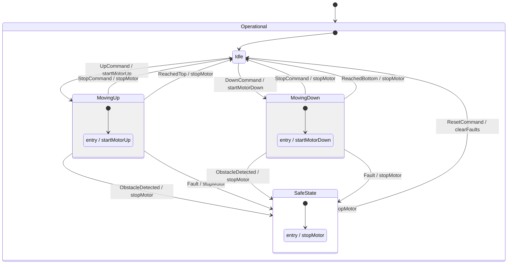

```mermaid
stateDiagram-v2
    [*] --> Operational

    state Operational {
        [*] --> Idle

        Idle --> MovingUp : UpCommand / startMotorUp
        Idle --> MovingDown : DownCommand / startMotorDown
        
        state MovingUp {
            [*] --> MovingUp_Run
            MovingUp_Run : entry / startMotorUp
        }
        
        state MovingDown {
            [*] --> MovingDown_Run
            MovingDown_Run : entry / startMotorDown
        }

        MovingUp --> Idle : StopCommand / stopMotor
        MovingUp --> Idle : ReachedTop / stopMotor
        
        MovingDown --> Idle : StopCommand / stopMotor
        MovingDown --> Idle : ReachedBottom / stopMotor
        
        MovingUp --> SafeState : ObstacleDetected / stopMotor
        MovingUp --> SafeState : Fault / stopMotor
        MovingDown --> SafeState : ObstacleDetected / stopMotor
        MovingDown --> SafeState : Fault / stopMotor
    }

    Operational --> SafeState : Fault / stopMotor

    state SafeState {
        [*] --> SafetyLock
        SafetyLock : entry / stopMotor
    }
    
    SafeState --> Idle : ResetCommand / clearFaults
```